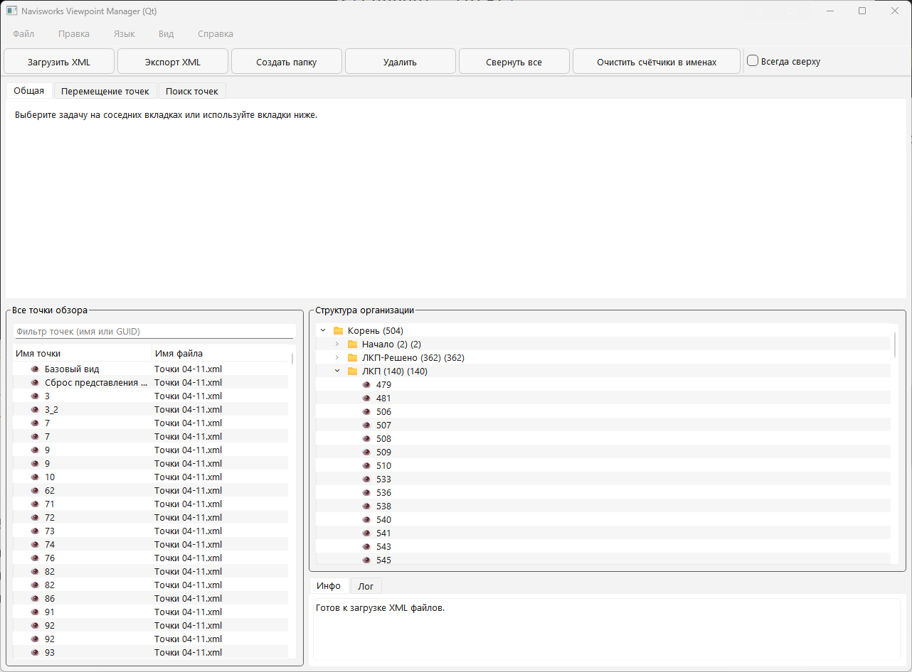
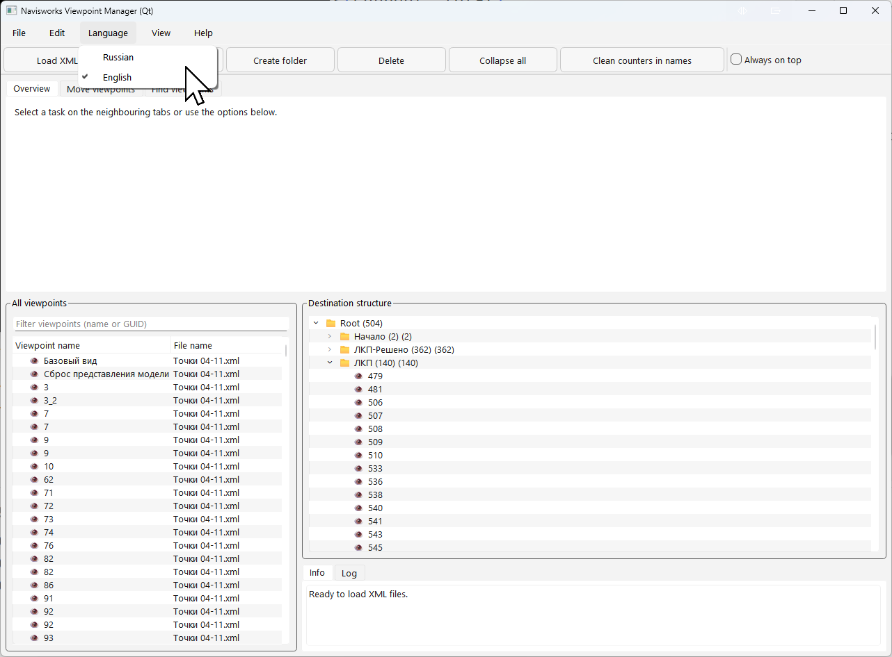

# Navisworks Viewpoint Manager

**Версия:** 1.0.0  
**Языки:** Русский, English

Приложение для организации и управления точками обзора из файлов Navisworks (.xml) с современным Qt-интерфейсом.

## 🖼️ Скриншоты





## 📦 Загрузка

### Готовый EXE файл
Скачайте последнюю версию из раздела [Releases](https://github.com/mikhalchankasm/navisworks-external-viewpoint-manage/releases) или из [артефактов сборки](https://github.com/mikhalchankasm/navisworks-external-viewpoint-manage/actions).

### Сборка из исходников
```bash
# Клонировать репозиторий
git clone https://github.com/mikhalchankasm/navisworks-external-viewpoint-manage.git
cd navisworks-external-viewpoint-manage

# Установить зависимости
pip install -r requirements.txt

# Запустить приложение
python navisworks_viewpoint_manager_qt.py

# Или собрать EXE файл
python build_exe.py
```

## ✨ Возможности

- ✅ **Многоязычный интерфейс** (русский/английский)
- ✅ Загрузка XML файлов с точками обзора
- ✅ **Двухпанельный интерфейс**: левое дерево (все точки) + центральное дерево (структура)
- ✅ **Drag & Drop между деревьями** - перетаскивание точек из левого дерева в структуру
- ✅ **Множественный выбор** точек (Ctrl+клик, Shift+клик)
- ✅ Массовое перемещение точек по именам
- ✅ Поиск точек обзора по именам
- ✅ Создание новых папок
- ✅ Переименование элементов
- ✅ Удаление элементов
- ✅ Сортировка элементов (естественная, по GUID)
- ✅ Экспорт в итоговый XML файл
- ✅ Просмотр информации о точках обзора
- ✅ Контекстное меню по правому клику
- ✅ Горячие клавиши для быстрого доступа
- ✅ Режим "Всегда сверху"
- ✅ Очистка счётчиков в именах папок

## 🚀 Запуск

### Windows (EXE)
Просто запустите `Navisworks Viewpoint Manager v1.0.0.exe` - никаких дополнительных установок не требуется.

### Из исходников
```bash
python navisworks_viewpoint_manager_qt.py
```

## 🖥️ Интерфейс

### Левая панель - "Все точки обзора"
- Показывает все точки обзора из загруженных файлов
- Источник для перетаскивания в структуру
- Поддерживает множественный выбор
- Фильтрация по имени или GUID
- Отображение имени точки и файла-источника

### Центральная панель - "Структура организации"
- Отображает текущую структуру папок и точек
- Место назначения для перетаскивания
- Поддерживает создание папок, удаление, переименование
- Контекстное меню по правому клику
- Сортировка элементов

### Правая панель - "Информация"
- Показывает детали выбранного элемента
- Лог операций

### Вкладки задач
- **Общая** - обзор и инструкции
- **Перемещение точек** - массовое перемещение точек по именам
- **Поиск точек** - поиск точек по списку имен

## 📖 Использование

### Основные операции
1. **Загрузка файлов**: Файл → Загрузить XML... (или Ctrl+O)
2. **Создание папок**: Правка → Создать папку (или Ctrl+N)
3. **Организация точек**: Перетаскивайте точки из левого дерева в центральное
4. **Экспорт**: Файл → Экспорт XML... (или Ctrl+S)

### Массовое перемещение
1. Откройте вкладку "Перемещение точек"
2. Введите имена точек (каждое на новой строке или через выбранный разделитель)
3. Выберите целевую папку
4. Нажмите "Переместить"

### Поиск точек
1. Откройте вкладку "Поиск точек"
2. Введите имена точек через пробел (например: `1311 1312 1314`)
3. Нажмите "Поиск"
4. Результаты покажут найденные и не найденные точки
5. Можно скопировать результаты в буфер обмена

### Drag & Drop
- **Из левого в центральное дерево**: Выберите точку слева и перетащите в папку справа
- **Внутри центрального дерева**: Перемещение элементов между папками
- **Визуальная обратная связь**: Курсор показывает возможность перемещения

### Горячие клавиши
- **Ctrl+O** - Загрузить XML файлы
- **Ctrl+N** - Создать папку
- **Del** - Удалить выбранный элемент
- **F2** - Переименовать элемент
- **Ctrl+S** - Экспортировать в XML
- **Ctrl+L** - Свернуть все папки

### Управление мышью
- **Перетаскивание** - перемещение элементов между деревьями
- **Правый клик** - контекстное меню с дополнительными опциями
- **Ctrl+клик** - множественный выбор элементов
- **Сортировка** - через контекстное меню

## 🌍 Языки

Приложение поддерживает два языка:
- **Русский** (по умолчанию)
- **English**

Переключение: меню **Язык** → выберите нужный язык.

## 📁 Структура файлов

Приложение понимает стандартную структуру XML файлов Navisworks:
- `<view>` - точки обзора
- `<viewfolder>` - папки для группировки

Внутренняя структура точек обзора сохраняется без изменений.

## 🔧 Требования

### Для запуска EXE
- Windows 7 или новее
- Никаких дополнительных зависимостей не требуется

### Для запуска из исходников
- Python 3.8+
- PySide6 (Qt для Python)
- См. `requirements.txt` для полного списка зависимостей

## 🛠️ Сборка

### Локальная сборка
```bash
# Установить зависимости
pip install -r requirements.txt
pip install PyInstaller

# Собрать EXE
python build_exe.py
```

EXE файл будет создан в папке `dist/` с именем, включающим версию.

### Автоматическая сборка в GitHub Actions

При каждом пуше в ветку `master` или `main`, а также при создании тега `v*` автоматически запускается сборка Windows EXE.

**Скачать артефакты сборки:**
1. Перейдите в раздел [Actions](https://github.com/mikhalchankasm/navisworks-external-viewpoint-manage/actions)
2. Выберите нужный workflow run
3. В разделе "Artifacts" скачайте собранный EXE файл

**Создание релиза:**
1. Создайте тег с версией: `git tag v1.0.0`
2. Отправьте тег: `git push origin v1.0.0`
3. GitHub Actions автоматически создаст Release с собранным EXE файлом

## 📝 Версионность

Версия указывается в файле `version.py`. При создании тега `v*` автоматически создаётся релиз с собранным EXE файлом.

Текущая версия отображается в окне "О программе" (меню Справка → О программе).

## 📄 Лицензия

См. файл LICENSE (если есть) или уточните у автора.

## 🤝 Вклад

Вклад в проект приветствуется! Создавайте Issues и Pull Requests.

## 📞 Поддержка

Если возникли проблемы или вопросы:
- Создайте [Issue](https://github.com/mikhalchankasm/navisworks-external-viewpoint-manage/issues)
- Проверьте раздел [Releases](https://github.com/mikhalchankasm/navisworks-external-viewpoint-manage/releases) для последних версий
